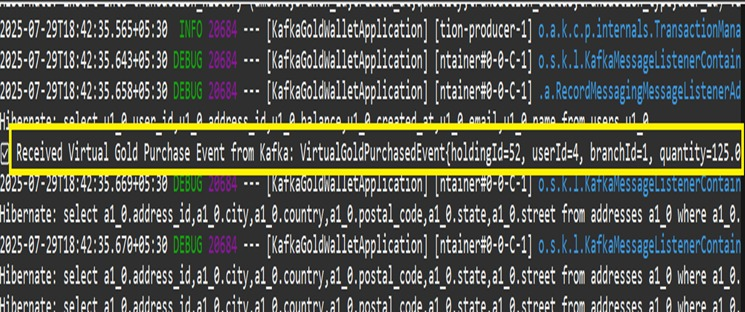

# 🏦 GoldWallet Monolith Web Application with Kafka

A complete Spring Boot monolith web application for managing digital gold transactions, enhanced with **Apache Kafka** for event-driven communication.  
This README provides detailed instructions to run the project, understand the Kafka integration, project structure, configuration, and outlines future upgrade plans.

> **Note:** This application is currently monolithic — future work will convert each entity into a separate microservice with Kafka integration for scalability.

---

## 📑 Table of Contents

1. [Project Overview](#-project-overview)
2. [Technology Stack](#-technology-stack)
3. [Screenshots](#️-screenshots)
4. [Project Structure](#-project-structure)
5. [Application Configuration](#-application-configuration)
6. [Kafka - topic, producer & consumer, how to test via browser](#-kafka--topic-producer--consumer-how-to-test-via-browser)
7. [Endpoints Overview](#-endpoints-overview)
8. [Prerequisites](#-prerequisites)
9. [Run Instructions](#-run-instructions)
10. [Future Enhancements](#-future-enhancements)
11. [Contact](#-contact)

---

## 📌 Project Overview

GoldWallet Monolith Web Application provides a platform to manage **digital gold holdings**.  
It allows users to register, vendors to onboard, and both to carry out digital gold transactions such as **buying, selling, and tracking holdings**.

With **Apache Kafka integration**, the system becomes **event-driven**:

- Every **virtual gold purchase** is published as an **event** to Kafka.
- Other services (or modules) can **consume these events** and process them asynchronously.

This approach ensures:  
✔️ **Scalability** — multiple consumers can process events in parallel.  
✔️ **Decoupling** — producers and consumers don’t depend directly on each other.  
✔️ **Reliability** — events are persisted in Kafka topics until consumed.

---

## 💻 Technology Stack

This project combines **Spring Boot** for web + API logic with **Kafka** for event streaming:

- **Java 17** — the programming language.
- **Spring Boot 3.x** — framework for building REST APIs and MVC web apps.
- **Spring MVC** — separates Controllers, Services, and Repositories.
- **Apache Kafka** — distributed streaming platform that handles the messaging between producer and consumer.
- **Spring for Apache Kafka** — Spring Boot integration library for Kafka.
- **MySQL** — relational database to store user, vendor, and transaction data.
- **Maven** — build tool and dependency manager.
- **Thymeleaf + Bootstrap/CSS** — to build a responsive UI.

---

## 🖼️ Screenshots

### GoldWallet User Triggering Point


### GoldWallet Admin Triggering Point


### GoldWallet Kafka-Event


### GoldWallet Kafka-Message



---

## 📂 Project Structure

The code follows a standard Spring Boot structure:

```
GoldWalletKafkaApplication/
├── src/
│ ├── main/
│ │ ├── java/com/...
│ │ │ ├── controllers/ # Handle HTTP requests (REST & MVC endpoints)
│ │ │ ├── services/ # Business logic (buy/sell gold, validation)
│ │ │ ├── repositories/ # Database interaction with MySQL
│ │ │ ├── kafka/ # Producer & Consumer classes for Kafka
│ │ │ └── entities/ # Domain models like User, Vendor, Transaction
│ │ ├── resources/
│ │ │ ├── static/ # CSS, JS files for UI
│ │ │ ├── templates/ # Thymeleaf HTML templates for pages
│ │ │ └── application.properties # App + Kafka config
│ └── test/ # Unit & integration tests
├── pom.xml # Maven dependencies
└── README.md # Documentation
```

**Kafka Components:**

- `KafkaVirtualGoldProducer` → Publishes purchase events to Kafka.
- `KafkaVirtualGoldConsumer` → Subscribes to topic and processes events.

---

## ⚙ Application Configuration

Configuration is managed in `application.properties`.

**Sample Kafka settings:**

```bash
spring.application.name=GoldWalletKafkaApplication
server.port=8085

## YOUR DATABASE CONFIGURATONS
# --- Add Here ---

# Kafka settings
### Kafka Bootstrap Server ###
spring.kafka.bootstrap-servers=localhost:9092

### Producer Configuration ###
spring.kafka.producer.key-serializer=org.apache.kafka.common.serialization.StringSerializer
spring.kafka.producer.value-serializer=org.springframework.kafka.support.serializer.JsonSerializer

### Consumer Configuration ###
spring.kafka.consumer.group-id=YOUR_GROUP_ID
spring.kafka.consumer.key-deserializer=org.apache.kafka.common.serialization.StringDeserializer
spring.kafka.consumer.value-deserializer=org.springframework.kafka.support.serializer.JsonDeserializer
spring.kafka.consumer.properties.spring.json.trusted.packages=*

### Listener Container Factory ###
spring.kafka.listener.missing-topics-fatal=false

### Enable Kafka client logging ###
logging.level.org.apache.kafka=INFO
logging.level.org.springframework.kafka=DEBUG
logging.level.org.springframework.kafka.core.KafkaTemplate=DEBUG
logging.level.org.springframework.kafka.listener.KafkaMessageListenerContainer=DEBUG
logging.level.org.springframework.kafka.config.ConcurrentKafkaListenerContainerFactory=DEBUG
```

bootstrap-servers → Kafka broker address.  
consumer.group-id → Identifies the group of consumers reading the same topic.  
topic.virtual-gold → Custom property for the topic used in this app.

## 📨 Kafka - topic, producer & consumer, how to test via browser

Kafka is at the heart of this project. It allows the application to publish events (producer) and listen for them (consumer).

### Topic Details

- **Topic Name:** `virtual-gold-purchased-events`
- **Consumer Group:** `gold-group`

### Code Flow

1. A user or admin triggers a gold purchase via HTTP endpoint.
2. The `KafkaVirtualGoldProducer` sends the purchase event to Kafka.
3. The `KafkaVirtualGoldConsumer` listens on the same topic and processes the event asynchronously.

### Start Kafka

#### Option A - Local Installation

```bash
# Start Zookeeper
.bin\windows\zookeeper-server-start.bat.\config\zookeeper.properties

# Start Kafka broker
.bin\windows\kafka-server-start.bat.\config\server.properties
```

#### Option B - Docker Compose

```bash
version: "3"
services:
  zookeeper:
    image: wurstmeister/zookeeper:3.4.6
    ports: ["2181:2181"]
  kafka:
    image: wurstmeister/kafka:2.13-2.6.0
    ports: ["9092:9092"]
    environment:
      KAFKA_ZOOKEEPER_CONNECT: zookeeper:2181
      KAFKA_ADVERTISED_HOST_NAME: localhost
```

## 🧪 Testing Flow (Browser or Curl)

1. Ensure Kafka (Zookeeper + broker) is running.
2. Start the application **GoldWalletKafkaApplication**.
3. Trigger the producer by calling one of the endpoints:

### User Side

```bash
curl -X POST "http://localhost:8085/api/v3/virtual_gold_holding/add?quantity=1.5&vendorId=1&userId=2"
```

### Admin Side

```bash
curl -X POST "http://localhost:8085/api/v1/virtual_gold_holding/add?quantity=2.0&vendorId=3&userId=5"
```

4. Open the application logs. You should see:

```
Producer → Sent event to topic: virtual-gold-purchased-events
✅ Consumer → Received Virtual Gold Purchase Event: {userId=2, vendorId=1, quantity=1.5}
```

👉 No need to use Kafka CLI (`kafka-console-producer.sh` / `kafka-console-consumer.sh`).  
The application itself acts as both **producer** and **consumer**.

---

## 🌐 Endpoints Overview

- **User-Side Endpoint (triggers Kafka event):**  
  `POST http://localhost:8085/api/v3/virtual_gold_holding/add`

- **Admin-Side Endpoint (also triggers Kafka event):**  
  `POST http://localhost:8085/api/v1/virtual_gold_holding/add`

### Dashboards

- User Dashboard → [http://localhost:8085/api/v3/](http://localhost:8085/api/v3/)
- Admin Dashboard → [http://localhost:8085/api/v1/](http://localhost:8085/api/v1/)

---

## 📋 Prerequisites

Before running the project, ensure:

- Java 17+ installed.
- Maven 3.x installed.
- MySQL running with a `digitalgoldwallet` schema (tables will be auto-created).
- Apache Kafka running (via local install or Docker).

---

## ▶ Run Instructions

### Method 1 - From IDE

1. Import as Maven project in IntelliJ/Eclipse/STS.
2. Update Maven dependencies.
3. Run `GoldWalletKafkaApplication.java`.
4. Open: [http://localhost:8085/api/v3/](http://localhost:8085/api/v3/)

### Method 2 - From Command Line

```bash
# Navigate to project folder
cd GoldWalletKafkaApplication

# Build the project
mvn clean package -DskipTests

# Run the JAR
java -jar target/GoldWalletKafkaApplication-0.0.1-SNAPSHOT.jar
```

---

## 🚀 Future Enhancements

To improve scalability, security, and usability, the following upgrades are planned:

### Entity-Based Microservices Architecture

- Split the monolith into independent microservices for User, Vendor, Wallet, and Transaction entities.
- Use Kafka for communication between services, enabling independent scaling and better fault isolation.

### Role-Based Access Control (RBAC)

- Secure endpoints with role-based authentication for Admin, Vendor, and User dashboards.
- Implement fine-grained permissions using JWT/OAuth2 for safe access management.

### Real-Time Gold Price Updates

- Connect with external gold price APIs to fetch and update live rates.
- Stream price updates via Kafka so all services and dashboards stay synchronized.

### Enhanced Reporting & Analytics

- Provide downloadable reports (PDF/Excel/CSV) for wallet and transaction history.
- Add visual dashboards with charts/graphs for insights into gold purchases and trends.

---

## 📬 Contact

Created with 💻 by [Pramodh Kumar](https://www.linkedin.com/in/tamminaina-pramodh-kumar-6433a4242)

For queries, issues, or contributions, please open an issue or connect directly.
